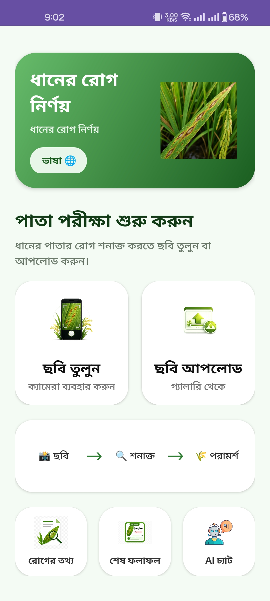
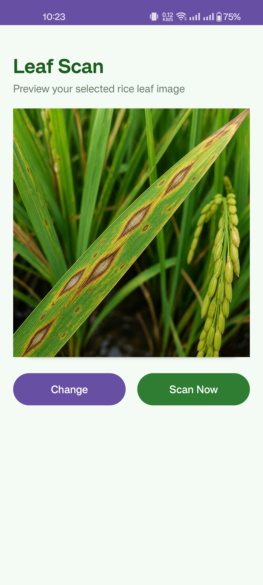
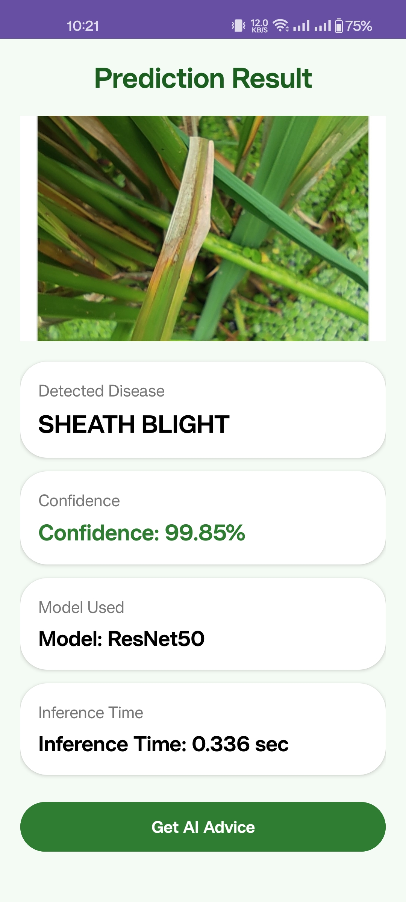
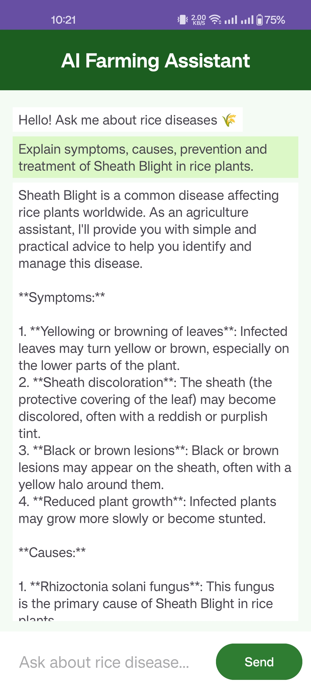
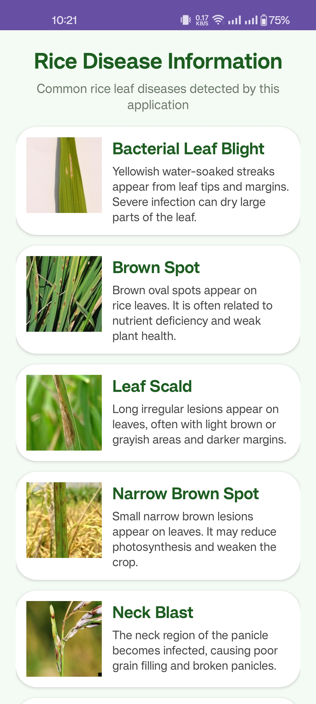
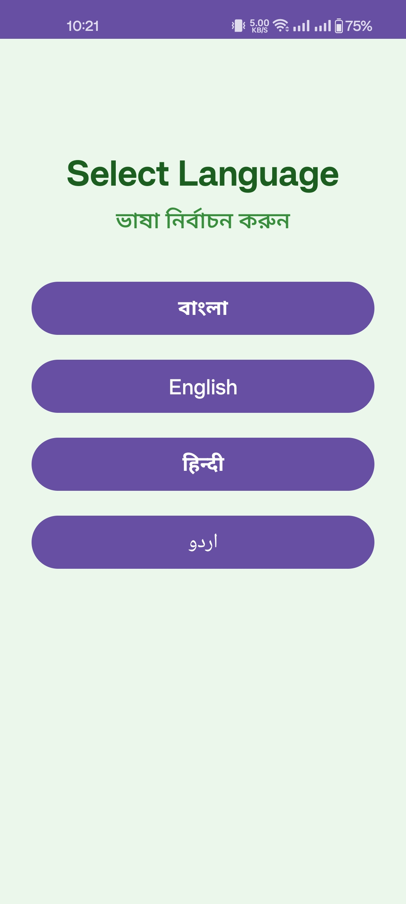

# 🌾 Rice Leaf Disease Detection

An Android application for **automatic rice leaf disease detection** using **Deep Learning Ensemble Learning** with an integrated **AI Farming Assistant**.

The application allows farmers, students, and researchers to capture or upload a rice leaf image and instantly receive disease prediction, confidence score, ensemble agreement, and AI-based treatment recommendations.

---

# 📱 Features

✅ Capture image using Camera

✅ Upload image from Gallery

✅ Deep Learning Stacking Ensemble Prediction

✅ AI Farming Assistant

✅ Multi-language Support
- English
- বাংলা
- हिन्दी
- اردو

✅ Disease Information Module

✅ Confidence Score & Model Agreement

✅ Inference Time Display

---

# 🧠 AI Model

The application uses a **Stacking Ensemble Learning** approach.

### Base Models

- ResNet50
- VGG16
- Xception
- MobileNetV2

### Meta Learner

- Logistic Regression

---

# 📊 Dataset

| Property | Value |
|-----------------|------------|
| Total Classes | 10 |
| Total Images | 12,339 |
| Train Images | 8,633 |
| Validation Images | 1,851 |
| Test Images | 1,855 |

### Classes

- Bacterial Leaf Blight
- Brown Spot
- Healthy
- Leaf Scald
- Narrow Brown Spot
- Neck Blast
- Rice Hispa
- Rice Blast
- Sheath Blight
- Tungro

---

# 📈 Model Performance

| Method | Accuracy |
|-----------------------------|------------|
| ResNet50 | 97.14% |
| VGG16 | 95.90% |
| Xception | 95.53% |
| MobileNetV2 | 94.29% |
| **Stacking Ensemble** | **97.79%** |

---

# 🏗 Technology Stack

### Android

- Java
- Android Studio
- Retrofit
- Material Design

### Backend

- FastAPI
- TensorFlow / Keras
- Scikit-Learn
- HuggingFace Spaces

### AI Assistant

- Groq API


---

## Download APK
[Download APK](https://github.com/abdullah6163/Rice_Leaf_Disease_Detection/blob/master/app/apk/Rice%20Leaf%20Disease%20Detection.apk)

# 📷 Application Screens

## 🏠 Home Screen



---

## 📸 Upload / Capture Image



---

## 🔍 Prediction Result



---

## 🤖 AI Farming Assistant



---

## 🌾 Disease Information



---

## 🌐 Language Selection



---

## ⚙ System Workflow

```
Rice Leaf Image
        │
        ▼
Image Preprocessing
        │
        ▼
ResNet50
VGG16
Xception
MobileNetV2
        │
        ▼
Probability Concatenation
        │
        ▼
Logistic Regression Meta Model
        │
        ▼
Final Prediction
        │
        ▼
AI Farming Assistant
```

---

# 📂 Project Structure

```
Rice_Leaf_Disease_Detection
│
├── app/
│   ├── src/
│   ├── images/
│   ├── build.gradle
│
├── gradle/
├── settings.gradle
├── README.md
```

---

# 🚀 Installation

Clone the repository

```
git clone https://github.com/abdullah6163/Rice_Leaf_Disease_Detection.git
```

Open with Android Studio

```
Sync Gradle

Run the application
```

---

# 🎯 Future Improvements

- Grad-CAM Visualization
- Automatic Rice Leaf Validation
- Offline AI Chat
- Real-time Camera Detection
- More Disease Classes
- Object Detection Integration

---

# 👨‍💻 Developer

**Md. Fahim Abdullah**
Department of Computer Science & Engineering
Daffodil International University
---

# 📜 License

This project is developed for educational and research purposes.
